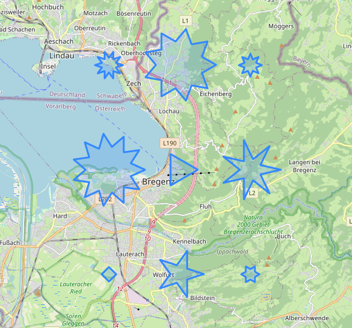

# Leaflet.StarCircle

Makes it possible to draw triangle, square, star(n-corner) with `L.StarCircleMarker` & `L.StarCircle` on Leaflet maps.

Look into the [Demo](https://haelue.github.io/Leaflet.StarCircle/). 



```js
var mapCenter = map.getCenter();
var star1 = L.starCircleMarker(mapCenter,{
    radius: 50,
    star: 3,
}).addTo(map);

var star2 = L.starCircle(L.latLng(mapCenter.lat, mapCenter.lng - 0.05), {
    radius: 500,
    star: 4,
}).addTo(map);

var star3 = L.starCircleMarker(L.latLng(mapCenter.lat, mapCenter.lng + 0.05), {
    radius: 50,
    star: 5,
}).addTo(map);
```

## Installation

Download **leaflet-starcircle.js** and include them in your project.

With script node:
```html
<script src="./leaflet-starcircle.js"></script>
```

With esm import:
```js
import "./leaflet-starcircle.js"
```

## Options:

| Option                              | Description                                                                               |
| :---------------------------------- | :---------------------------------------------------------------------------------------- |
| star                                | number of star corners. (<3: normal circle, 3: triangle, 4: square, >4: n-corner-star)     |